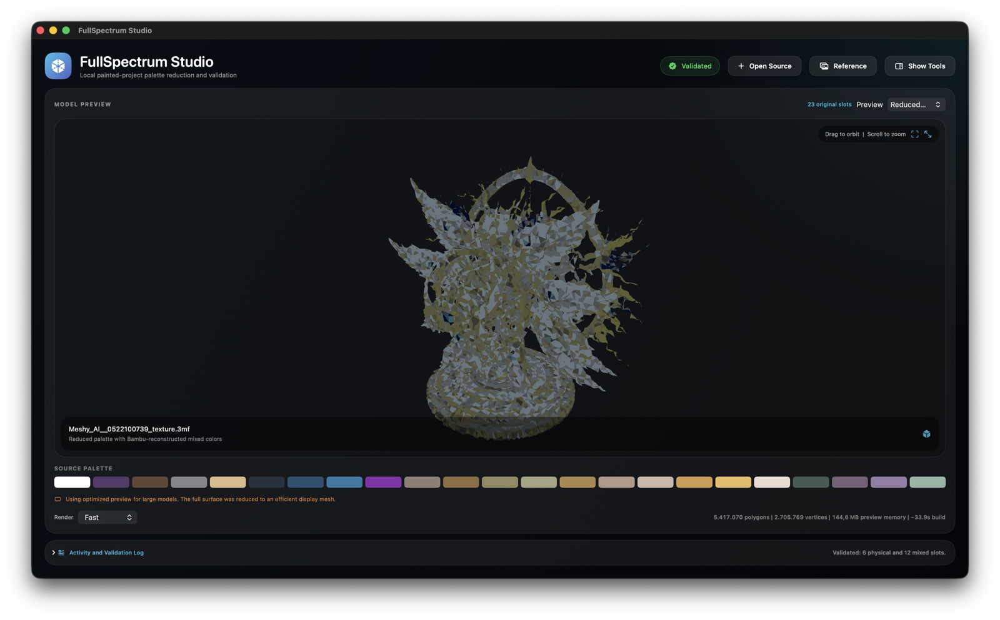

# FullSpectrum Studio

FullSpectrum Studio is a local desktop workflow for reducing the physical
filament count of painted Bambu Studio `.3mf` projects while trying to preserve
their original painted appearance.

It creates a separate converted `.3mf`, a recipe CSV and a validation report.
The source project is never modified.

This is an independent community preview built around the H2C public-beta
workflow and is not affiliated with Bambu Lab.

Latest correctness update: [v0.4.3 Community Preview](https://github.com/Gr33k3D/FullSpectrum-Studio/releases/tag/v0.4.3-community-preview)
fixes mixed-color prediction to follow Bambu Studio's loaded-color reconstruction.

## What It Does

- Reads Bambu serialized `paint_color` states from the model itself instead of
  assuming that paint order equals filament order.
- Chooses `2-6` physical filament anchors automatically or manually, then adds
  only mixed recipes whose estimated visual gain justifies the extra logical
  color. Identical recipes reuse one slot.
- Supports local Bambu Studio Beta inventory in read-only mode, Bambu PLA
  planning palettes, CMYKW workflows and custom local filament libraries.
- Accepts an optional `.obj`, `.glb` or texture image as a visual reference and
  reports estimated similarity, brightness, contrast and confidence.
- Imports constrained textured `.obj` and embedded-texture `.glb` sources
  experimentally as new painted projects, routed through the same validator.
- Provides the original plate render plus movable original, reduced/predicted,
  validation, heatmap, anchor-influence and wireframe previews on macOS.
- Reconstructs mixed swatches with Bambu Studio's `FilamentMixer` model and
  exports a color-validation report for app/export/Bambu comparisons.
- Keeps a mixed recipe only when Bambu's reconstructed color is within a
  reliable match threshold; otherwise it keeps the nearest physical anchor
  and warns that an additional real filament is needed.
- Opens large painted projects through a quick thumbnail/palette pass and
  builds a grid-reduced, memory-bounded movable preview instead of leaving the
  viewer blank or forcing a full multi-million-triangle display build.
- Can hand a validated output directly to Bambu Studio or OrcaSlicer when the
  selected slicer is installed.

## Preview



Preview estimates from a validated local test project; this is not a calibrated
printed-color measurement. Screenshots demonstrate view modes from a detail
run; the documented benchmark uses its stated validated planning setting, so
logical mixed-slot counts can differ.

Version v0.4.3 centers the viewer, adds fullscreen viewing and color-debug
comparison, displays target and exported mixed swatches separately, and
corrects mixed-color preview synchronization with Bambu Studio.

Additional real-project views:
[original plate](teasers/v0.4.3-original.png) |
[validation](teasers/v0.4.3-validation.png) |
[color-loss heatmap](teasers/v0.4.3-heatmap.png) |
[anchor influence](teasers/v0.4.3-anchor.png)

## Validation

Every output is reopened before it is accepted. The engine rejects output if:

- A `paint_color` state refers to a slot that does not exist.
- A mixed slot references itself, another mixed slot, duplicate components or
  components outside the physical slots.
- Filament arrays or purge matrices are misaligned, or a generated purge
  matrix contains a zero off-diagonal transition.
- Written paint states do not equal the exact expected decoded remap.
- `filament_colour` and `filament_multi_colour` disagree, or any saved mixed
  swatch differs from the color Bambu reconstructs from its recipe.
- Existing geometry, UV-bearing model data or source textures/resources change
  beyond permitted paint remapping.

Archive extraction is defensive and rejects unsafe archive paths and excessive
uncompressed archive sizes.

## Filament Choices

### My Inventory

Recommended for practical printing. Uses active PLA spools detected in the
local Bambu Studio Beta inventory and estimates available mixing capacity from
remaining material.

### Bambu Core

Plans with supported PLA Basic, PLA Matte and PLA Silk+ colors.

### All Bambu

Allows additional Bambu PLA families discovered locally. Catalog colors are
planning suggestions only; confirm current regional availability before buying.

### CMYKW

`Exact CMYKW` assigns literal CMYKW roles. `CMYKW` with inventory maps those
roles to owned colors and warns when a match is poor.

### Custom Brands

Accepts a JSON file in the format shown at
[examples/custom-palette.example.json](examples/custom-palette.example.json).

Mixed-color previews now use the same Bambu Studio reconstruction model as the
saved recipe display color. Quality scores still estimate closeness to the
source, not a calibrated physical print: material, layers and lighting remain
real-world variables.

## Reference And Source Import

Reference mode samples texture information from a `.glb`, an OBJ material
texture or an image, then compares dominant colors with the predicted reduced
palette. It can help choose a palette without changing the project's geometry.

Experimental textured source import creates a printable painted-project
candidate:

- OBJ requires complete UVs and a PNG/JPEG base-color texture. If its material
  link is missing, the app lets the user choose the base-color texture
  explicitly.
- GLB currently accepts uncompressed triangle primitives with positions, UVs,
  node transforms and one embedded texture.
- Images by themselves do not contain printable geometry.
- Imports over two million faces are rejected; very large raw GLBs remain
  useful as references to an already practical painted `.3mf`.
- Large `.3mf` projects use an automatically grid-reduced optimized preview and
  optimized analysis overlays. Palette conversion and archive validation
  still use the full project data.

## Printability Reporting

FullSpectrum reports logical mixed slots, painted mixed share, purge-transition
context and a pre-slice complexity rating. It does not guess exact print time,
swap count or filament grams from an unsliced painted project; those require
sliced toolpaths.

The quality-versus-waste control lets the user decide whether a predicted
improvement is worth additional logical mixed colors.

## macOS App

Requirements:

- macOS 14 or newer
- Swift 5.9 / Xcode command-line tools
- Python 3 supplied with macOS

```bash
./script/build_and_run.sh build
./script/build_and_run.sh run
```

The application is written to `dist/FullSpectrum Studio.app`. The viewer is
the primary workspace, with collapsible tools and activity log plus fullscreen
preview for screenshots and close visual inspection. Community preview ZIPs
have a verified ad-hoc bundle signature; they are not Developer ID notarized.

## Windows App

Windows uses the same Python conversion and validation engine in a desktop
shell. Tagged releases build a portable ZIP and installer through
[.github/workflows/windows-release.yml](.github/workflows/windows-release.yml).
The macOS orbitable analysis viewer is not present in the Windows UI.

A Tauri v2 Windows desktop app now lives in
[apps/windows-tauri](apps/windows-tauri). It has a React/TypeScript UI, Rust
runtime commands, installer configuration, native file pickers, source
inspection, output-folder selection, reference selection and a real conversion
bridge into the FullSpectrum engine. The native GPU/orbitable 3D renderer is
still a migration target, so the Tauri preview uses source thumbnails and
validated metadata until the shared renderer layer is ready. See
[docs/WINDOWS_TAURI_MIGRATION.md](docs/WINDOWS_TAURI_MIGRATION.md) and
[docs/MIGRATION_MAP.md](docs/MIGRATION_MAP.md).

## OrcaSlicer Handoff

The app now offers `OrcaSlicer` as an output destination. FullSpectrum still
does the palette reduction and validation first, then opens the separately
saved `.3mf` in an installed OrcaSlicer application.

This is intentionally a file handoff, not an OrcaSlicer plugin. Validation of
Bambu mixed-filament loaded swatches remains Bambu-specific; when opening a
FullSpectrum file in OrcaSlicer, inspect filament assignments and slice a
small test before committing to a color-sensitive print. See
[docs/ORCASLICER_HANDOFF.md](docs/ORCASLICER_HANDOFF.md).

## Command Line

Painted `.3mf` conversion with a visual reference:

```bash
python3 fullspectrum_engine.py --mode official --palette-source inventory \
  --real-slots auto --quality-bias 60 --reference original.glb painted-project.3mf
```

Experimental textured OBJ import:

```bash
python3 fullspectrum_engine.py --mode official --palette-source catalog \
  --quality-bias 60 textured-source.obj
```

Reproducible local planning variants:

```bash
python3 tools/benchmark_quality.py --reference original.glb painted-project.3mf
```

## Privacy And Safety

- Inventory access is local and read-only. No spool identifiers, quantities or
  local inventory paths are written to generated shareable text reports.
- Packaged macOS executables are stripped of local build-path/debug symbols
  before release archives are produced.
- Private model projects, generated outputs, inventories and private
  screenshots are not committed to this repository.
- Before printing, verify filament assignments, purge settings and slicing in
  Bambu Studio; physical appearance still depends on filament and calibration.

## Documentation

- [Final Report](FINAL_REPORT.md)
- [Benchmark](BENCHMARK.md)
- [Changelog](CHANGELOG.md)
- [Research](RESEARCH.md)
- [Ideas](IDEAS.md)
- [Roadmap](ROADMAP.md)
- [Implementation Plan](IMPLEMENTATION_PLAN.md)
- [Architecture](docs/ARCHITECTURE.md)
- [Validation And Testing](docs/VALIDATION.md)
- [Color Validation](COLOR_VALIDATION.md)
- [Third-Party Notices](THIRD_PARTY_NOTICES.md)
- [Security And Privacy](docs/SECURITY_PRIVACY.md)
- [0.4 Release Notes](docs/RELEASE_NOTES_0.4.md)
- [0.4.1 Reliability Notes](docs/RELEASE_NOTES_0.4.1.md)
- [0.4.2 Button Fix Notes](docs/RELEASE_NOTES_0.4.2.md)
- [0.4.3 Color Synchronization Notes](docs/RELEASE_NOTES_0.4.3.md)
- [OrcaSlicer Handoff](docs/ORCASLICER_HANDOFF.md)
- [Bambu Forum Update Draft](docs/BAMBU_FORUM_POST_v0.4.3.md)

## License

Released under the [PolyForm Noncommercial License 1.0.0](LICENSE). It is
shared for non-commercial community use and modification; it is not an
OSI-approved open-source license and does not permit commercial exploitation.
