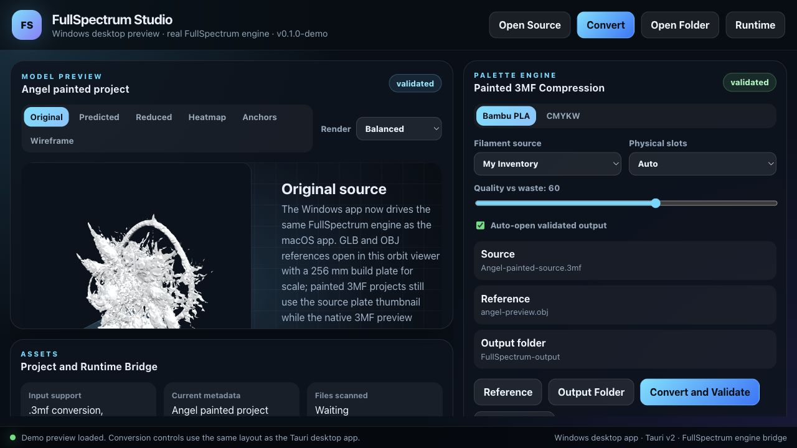
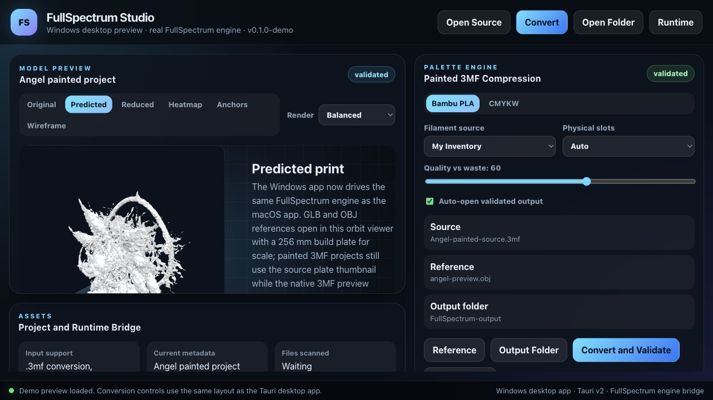

# Forum Reply Draft

Small update on the Windows version:

I was not happy with the first Windows preview, so I reworked it properly. It
now uses the same FullSpectrum conversion engine as the macOS app instead of
just being a placeholder UI.

What is working now:

- open painted `.3mf`, `.obj` or `.glb` sources
- choose Bambu PLA / CMYKW strategy
- choose inventory, catalog or all-Bambu filament sources
- set physical slot count and quality-vs-waste
- choose an optional visual reference
- choose an output folder
- convert and validate from the Windows app
- open the validated output folder
- preview GLB/OBJ references in a proper orbit viewer with a 256 mm build plate
  for scale

The 3D viewer is still not final, but it is already much closer to what I
wanted: a practical preview space instead of a flat placeholder. For heavy
painted 3MFs it still falls back safely so it does not try to eat the whole
computer.

Screenshots below are from the Windows/Tauri preview using an optimized preview
of the angel model. I am only sharing screenshots here, not the source `.3mf`,
`.glb` or generated geometry.

This is still a community preview, but it is now moving in the right direction:
painted project in, reduced-filament validated project out, without losing the
original paint mapping.
